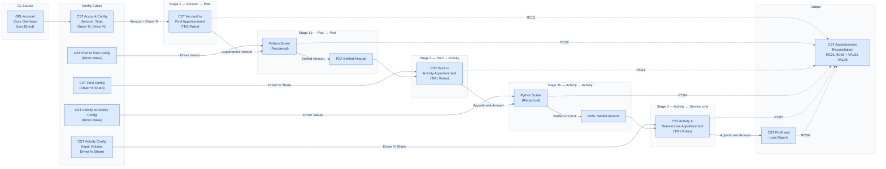

# CST Apportionment Flow

```mermaid
%%{init: {
  'theme': 'base',
  'themeVariables': {
    'fontSize': '16px',
    'primaryColor': '#dbeafe',
    'primaryBorderColor': '#2563eb',
    'primaryTextColor': '#1e3a5f',
    'secondaryColor': '#f0f4ff',
    'tertiaryColor': '#e8f5e9',
    'background': '#ffffff',
    'mainBkg': '#dbeafe',
    'nodeBorder': '#2563eb',
    'clusterBkg': '#f8fafc',
    'clusterBorder': '#cbd5e1',
    'lineColor': '#475569',
    'edgeLabelBackground': '#f1f5f9',
    'titleColor': '#1e3a5f'
  }
}}%%
flowchart LR
    subgraph GL["GL Source"]
        ACC["GBL Account\n(6xxx Overhead\n5xxx Direct)"]
    end

    subgraph CFG["Config Cubes"]
        ACCCFG["CST Account Config\n(Amount, Type,\nDriver %, Direct %)"]
        POOLCFG["CST Pool Config\n(Driver % Share)"]
        ACTCFG["CST Activity Config\n(Input Volume,\nDriver % Share)"]
        P2PCFG["CST Pool to Pool Config\n(Driver Value)"]
        A2ACFG["CST Activity to Activity Config\n(Driver Value)"]
    end

    subgraph STAGE1["Stage 1 — Account → Pool"]
        A2P["CST Account to\nPool Apportionment\n(TM1 Rules)"]
    end

    subgraph STAGE1B["Stage 1b — Pool → Pool"]
        P2P["Python Solver\n(Reciprocal)"]
        P2A_SA["P2A Settled Amount"]
    end

    subgraph STAGE2["Stage 2 — Pool → Activity"]
        P2A["CST Pool to\nActivity Apportionment\n(TM1 Rules)"]
    end

    subgraph STAGE2B["Stage 2b — Activity → Activity"]
        A2A["Python Solver\n(Reciprocal)"]
        A2SL_SA["A2SL Settled Amount"]
    end

    subgraph STAGE3["Stage 3 — Activity → Service Line"]
        A2SL["CST Activity to\nService Line Apportionment\n(TM1 Rules)"]
    end

    subgraph OUTPUT["Output"]
        PL["CST Profit and\nLoss Report"]
        RECON["CST Apportionment\nReconciliation\nRC01-RC06 + VAL01-VAL06"]
    end

    ACC --> ACCCFG
    ACCCFG -->|Amount + Driver %| A2P
    POOLCFG -->|Driver % Share| P2A
    ACTCFG -->|Driver % Share| A2SL
    P2PCFG -->|Driver Values| P2P
    A2ACFG -->|Driver Values| A2A

    A2P -->|Apportioned Amount| P2P
    P2P -->|Settled Amount| P2A_SA
    P2A_SA --> P2A
    P2A -->|Apportioned Amount| A2A
    A2A -->|Settled Amount| A2SL_SA
    A2SL_SA --> A2SL
    A2SL -->|Apportioned Amount| PL

    A2P -.->|RC01| RECON
    P2P -.->|RC02| RECON
    P2A -.->|RC03| RECON
    A2A -.->|RC04| RECON
    A2SL -.->|RC05| RECON
    PL -.->|RC06| RECON
```
